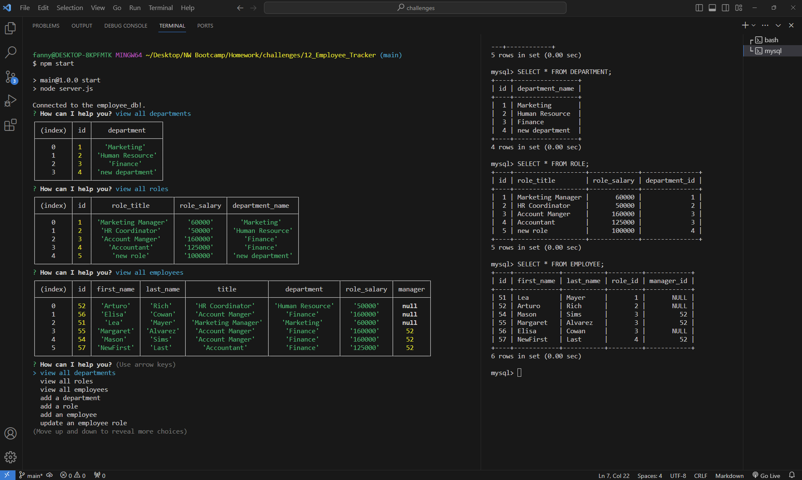

# Employee Tracker

## Description
A command-line application to manage a company's employee database, using Node.js, Inquirer, and MySQL.

## Screenshot

## GitHub Repo
https://github.com/FannyCandy/12_Employee_Tracker

## Walkthrough video
https://drive.google.com/file/d/1qa9F1E-qWHv1mSlXhcLhQThZj8UyRhJT/view?usp=sharing

## Credit / Resources used
NU BootCamp curriculum